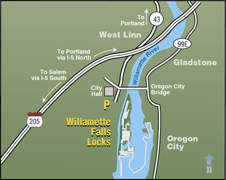

## Overview
In this report we explore timeseries data of three salmoniod fish species, Coho, Jack Coho, and Steelhead, as they pass through the Willamette Falls fish ladder in Oregon, USA. We visually explore the data by making a time series plot, we explore seasonality through a season plot, and show the annual species count. Observations were recorded from 2001-01-01 to 2010-12-31 and are limited to adult fish.



### Data citation
Colombia Basin Research DART Adult Passge Graphics and Text. Accessed 2021-02-4. Data Courtesy of U.S. Army Corps of Engineers, NWD and Chelan, Douglas, and Grant County PUDs, Yakima Klickitat Fisheries Project, Colville Tribes Fish & Wildlife (OBMEP), Oregon Department of Fish & Wildlife, Washington Department of Fish & Wildlife. [http://www.cbr.washington.edu/dart/query/adult_graph_text](http://www.cbr.washington.edu/dart/query/adult_graph_text)

```{r setup, include=FALSE}
knitr::opts_chunk$set(
	echo = TRUE,
	message = FALSE,
	warning = FALSE
)
library(tidyverse)
library(lubridate)
library(here)
library(janitor)
library(tsibble)
library(patchwork)
library(feasts)
```

## Willamette Falls Fish Passage Timeseries Summary {.tabset}

### Original Time Series

```{r}
#first read in the data
fish_passage <- read_csv(here("data", "willamette_fish_passage.csv")) %>% 
  clean_names()

#format dates and turn into tsibble  
fish_tsibble <- fish_passage %>% 
  mutate(date = lubridate::mdy(date)) %>% 
  as_tsibble(key = NULL, index = date)

#select coho, jack coho, and steelhead
cjs_tsibble <- fish_tsibble %>% 
  select("coho", "jack_coho", "steelhead")

#Turn NA values to zero
cjs_tsibble[is.na(cjs_tsibble)] <- 0

#graph for each species in ggplot, stored for later use in patchwork
coho_graph <- ggplot() + 
  geom_line(data = cjs_tsibble, 
            aes(x = date, y = coho),
            color = "deeppink3") +
  theme_minimal() +
  labs(x = "Year", y = "Coho")

steelhead_graph <- ggplot() +
  geom_line(data = cjs_tsibble, 
            aes(x = date, y = steelhead),
            color = "blue") +
  theme_minimal() +
  labs(x = "Year", y = "Steelhead")

jack_coho_graph <- ggplot() +
  geom_line(data = cjs_tsibble,
            aes(x = date, y = jack_coho),
            color = "darkgreen") +
  theme_minimal() +
  labs(x = "Year", y = "Jack Coho")

#make a patchwork graph and store it
fish_patchwork <- coho_graph/steelhead_graph/jack_coho_graph

#Call patchwork and add caption
fish_patchwork + plot_annotation(caption = "Time series of Salmon Species Passing Willamette Falls 2001-2010")
  
```

- All three species exhibit clear seasonality 

- Steelhead are the most numerous fish of the three species to be observed

### Seasonplots
```{r}
#Using gg_season to create seasonplots and storing them for use in patchwork
coho_seasonplot <- gg_season(data = cjs_tsibble, y = coho, show.legend = FALSE) + #hiding all but one legend to reduce crowding
  theme_minimal() +
  labs(x = "Month",
       y = "Coho")


steelhead_seasonplot <- gg_season(data = cjs_tsibble, y = steelhead) +
  theme_minimal() +
  labs(x = "Month",
       y = "Steelhead")


jack_coho_seasonplot <- gg_season(data = cjs_tsibble, y = jack_coho, show.legend = FALSE) +
  theme_minimal() +
  labs(x = "Month",
       y = "Jack Coho")

#Patchwork season plots and storing
seasonplot_pw <- coho_seasonplot/steelhead_seasonplot/jack_coho_seasonplot 


#Calling out stored patchwork season plots
seasonplot_pw + plot_annotation(caption = "Season Plots of Salmon Species Passing Willamette Falls 2001-2010")

```

* The season for Coho seems to extend longer from 2008-2010

* Coho and Jack Coho have similar seasonality whereas the season for Steelheads corresponds with offseason for the Coho and Jack Coho

### Annual Counts by Species

```{r}
# Create subset from tsibble to get annual counts of coho, jack coho, and steelheads
cjs_counts <- cjs_tsibble %>% 
  mutate(year = year(date)) %>% 
  index_by(year) %>% 
  summarize(total_coho = sum(coho, na.rm = TRUE),
            total_jcoho = sum(jack_coho, na.rm = TRUE),
            total_steelhead = sum(steelhead, na.rm = TRUE))

# Create ggplots of the annual counts of each species
tot_coho_plot <- ggplot(data = cjs_counts, aes(x = year, y = total_coho)) +
  geom_line(color = "deeppink3", size = 1) +
  labs(x = NULL, y = "Coho") +
  scale_x_continuous(breaks = c(2001:2010)) +
  theme_minimal()

tot_steel_plot <- ggplot(data = cjs_counts, aes(x = year, y = total_steelhead)) +
  geom_line(color = "blue", size = 1) +
  labs(x = NULL, y = "Steelhead") +
  scale_x_continuous(breaks = c(2001:2010)) +
  theme_minimal()

tot_jcoho_plot <- ggplot(data = cjs_counts, aes(x = year, y = total_jcoho)) +
  geom_line(color = "darkgreen", size = 1) +
  labs(x = NULL, y = "Jack Coho") +
  scale_x_continuous(breaks = c(2001:2010)) +
  theme_minimal()

# Combine in patchwork graph
annual_count_pw <- (tot_coho_plot/tot_steel_plot/tot_jcoho_plot)

annual_count_pw
```

- Coho passage has been increasing over time, but shows a decreasing trend after 2009
- Steelhead  passage has been decreasing over time, with an increasing trend after 2009
- All three species dropped to low numbers in 2007

